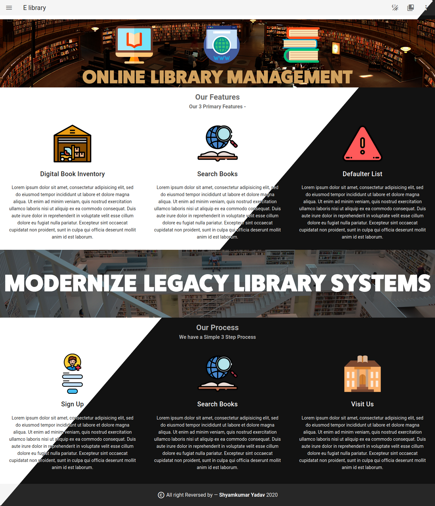

# [E-Pustakalay](https://epustakalay.pythonanywhere.com/)
[](../../commits/main "History") [](//github.com/shyamkumaryadav "Shyamkumar's Github") [](# "Forks Me")  [](# 'total watchers') [](# 'I am Happy') 


> ## install [Git](https://git-scm.com/ "git Site") or Download From Github  
> ## Install [python 3](https://www.python.org/ "Python Org. Site")  

---  
## First Clone The repo  

```bash
$ pip install pipenv # to use script install or update pipenv with latest version
$ mkdir ~/E_library
$ cd ~/E_library
$ git clone git@github.com:shyamkumaryadav/e-library-management-system.git .

### Django runserver
$ cd ~/E_library
$ pipenv shell
$ pipenv install
# uncomment if you forget to do
# $ pipenv run make # for makemigrations
$ pipenv run migrate
# $ pipenv run collect
$ pipenv run start
# Starting development server at http://0.0.0.0:8000/

```  

## Home Page Image

